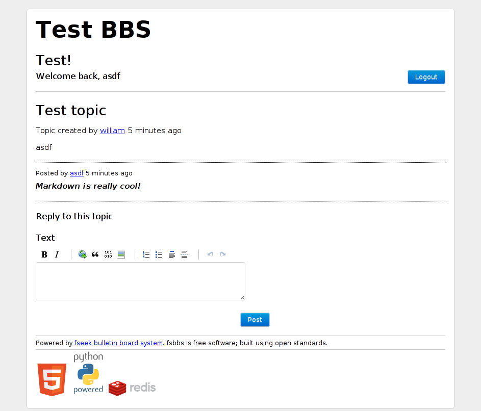

Klientsidan
============

*fsbbs* använder HTML5 och CSS3 för att ge användaren en mer
 desktop-liknande applikation i nyare webbläsare. Navigation mellan
 sidor, inloggning och registrering sker helt utan att hela sidan
 måste laddas om. När ett inlägg skrivs så ser användaren hur
 resultatet av hans markdown kod kommer att se ut när den är
 postad. Applikationen använder HTML5 History API:et där det finns
 stöd för detta.

Det är vanligt att AJAX applikationer inte stödjer användare som
av säkerhetskäl valt att stänga av JavaScript. Detta är dock inte
fallet med *fsbbs*, användaren förlorar vissa funktioner (såsom
Live-preview och AJAX navigering) men han kan göra samma saker som
användare med JavaScript påslaget kan.

Plugins
-------

Det är viktigt att bygga en applikation som bygger helt på öppna
standarder, därför har jag valt att inte använda Flash eller Java
någonstans i applikationen.

JavaScript
----------

Min javascript kod har endast två dependencies, prototype.js och
pagedown. prototype.js är ett populärt JavaScript bibliotek som lägger
till ett mer traditionellt objektorienterat till JavaScript samt
förenklar interaktionen med DOM igenom att lägga till användbara
methoder. Prototype.js finns inte med i källkoden till detta projekt
utan laddas ned från CDNJS (http://www.cdnjs.com) av klienten. CDNJS
är ett Content Delivery Network för javascript filer och bygger på
principen att om alla använder samma URL för sina JavaScript bibliotek
så kan den URLen cachas istället för att man för varje enskilld
applikation behöver ladda ned koden.

Pagedown är ett bibliotek för att rendera och editera
markdown copyright situationen för Pagedown är annorlunda då
författaren inte går att få tag på. Pagedown används och hålls vid liv
som ett OpenSource projekt av *StackOverflow.com*, vilka använder det för
sina markdown funktioner.

Varje gång en användare klickar på en länk så försöker klienten att
hitta en **data-id** attribut på det klickade elementet om detta inte
hittas så letar skriptet vidare på detta elementets förälder och
kontrollerar samma sak framtills att den antingen hittar en
**data-id** attribut eller kommer till toppen av dokumentet. Ifall
inget id kan hittas så följs browserns default betende. Om ID hittas
så inleds en XHR till /api/get_thing.json med ID som en parameter. När
requesten har fullföljts så skickas det returnerade JSON-datat till
parseThing som konverterar datum till ett bättre format och
konverterar markdown till HTML. Efter detta har gjorts så renderas en
HTML template för datat och denna ersätter innehållet i #things. Efter
att innehållet renderats så uppdateras också forumläret efter vilken
sorts data som renderades.

Layout
------

Standard temat som följer med applikationen är grafiskt sätt väldigt
enkelt och använder inga bilder i layouten, detta är förståss väldigt
tråkigt att ha på ett forum, men eftersom att alla forum är olika kan
så kan man inte ha något standard tema som passar
alla. 

Funktionsmässigt är dock standard temat iframkant. Det använder en
layout som med hjälp av *media* *queries* är fluidt till och med på
smartphones. Vissa UI element göms eller flyttas beronde på vilken
storlek på skärmen användaren har. Exempelvis, på en skärm med
1920x1080 (vilket är relativt vanligt nu för tiden) så kan vertikalt
utrymme sparas igenom att preview fönstret för markdown visas sida vid
sida med inläggs-formuläret.

### UI Element

**Knappar**, de knappar som på sidan är inspirerade av de som används
  i "Twitter Bootstrap" men anpassade för att fungera med denna
  applikationen.
  
**Dialogfönster** på sidan är anpassade från $(FILLTHISIN)$ men
  omvandlade för att ens fungera på fluida layouts. Dessa dialog
  fönster animeras helt av CSS och är därför snabbare än de som görs
  med endast JavaScript, och de blockerar heller inte UI-tråden vilket
  gör att UI:t känns snabbare. 
  
**Markdown editorn** använder samma ikoner och layout som
  stackoverflow, denna layout är mycket bra men i framtida versioner
  är möjligt det att en del av knapparna ändras efter de behov som ett
  forum har.

